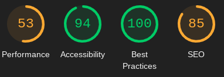
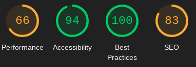
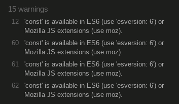

[Return to README](https://github.com/brianmcananeyREADME.md)

---

# Testing <!-- omit in toc -->

## Automated vs Manual Testing

Automated testing and manual testing, when used in combination, are able to achieve a greater level of testing coverage. Automated testing is good for repetitive and critical tasks, while manual testing is good for new or changing requirements and exploratory testing.

---

## Manual Testing

Manual testing allows the tester to explore the site and using experience and creativity to find any issues within the site. It also takes into account flexibility and context, manual testing paramaters can be changed quickly depending on the requirements. The tester can also take into account the prospective users and their knowledge of the system in order to execute tests that are relevant.  

| | Mobile S (320px)| Mobile L (425px)| Tablet (768px) | Desktop (1024px)|
|---|:---:|:---:|:---:|:---:|
|Responsive Images|✓|✓|✓|✓|
|Responsive Elements|✓|✓|✓|✓|
|Responsive Text|✓|✓|✓|✓|
|Responsive Nav Bar|✓|✓|✓|✓|

|Nav Bar Testing|Yes/No|
|---|:---:|
|Nav bar text and styles are loaded|✓|
|Nav bar collapse appears up to medium sized screens|✓|
|Nav links work as intended|✓|

|Index Page Testing|Yes/No|
|---|:---:|
|A title image is loaded and is respnsive across all screen sizes|✓|
|Two buttons appear on loading|✓|
|A blue button navigates to how to page|✓|
|A red buttom navigtes to quiz page|✓|

|Quiz Page Testing|Yes/No|
|---|:---:|
|Quiz question generated when page loads|✓|
|When user selects an answer a new question is generated|✓|
|When user gets correct answer, score increases by 1 point|✓|
|When user gets incorrect answer, no action|✓|
|When quiz finishes, score is stored in URL and user is automatically navigated to Final Score page|✓|

## Automated Testing

Automated tests are repeatable and reliable as there is limited risk for human error. It allows for testing on both a small and a large scale in a quick and efficient manner. Automated testing might be used to test the performance of a site in order to ensure that it can handle page loading.

# Responsiveness

Responsivity tests were carried out using Google Chrome DevTools. Device screen sizes covered include:

- iPhone SE
- iPhone 12 Pro
- Samsung Galaxy S20 Ultra
- iPad Air
- Surface Pro 7
- Surface Duo
- Samsung Galaxy A51/71

I also personally tested the website on Samsung Galaxy S22, Samsung Chrome book, Dell XPS 15 laptop and a Dell widescreen monitor.

### Lighthouse <!-- omit in toc -->

| Page | Test Results | Lighthouse Suggested Improvements |
|:---:|---|---|
|Index||Specifying a specific width and height of my title image, I wanted to retain as much responsivity as I could and opted to use bootstrap instead.|
|How To||As with the index page, utilising font-display to ensure the user can read any text if there is an issue/delay in the loading of webfonts, this could potentially improve this score.|
|Quiz||Properly sizing the images would reduce load time and cellular data, currently some images are oversized and are slowing down the time it takes for the page to load.|

### HTML and CSS Validation <!-- omit in toc -->

### HTML <!-- omit in toc -->

- All of the HTML pages passed the W3C HTML Validator.

### CSS <!-- omit in toc -->

- All pages passed the W3C CSS Validation.

# A11y Color Contrast Accessibility Checker

All website pages were tested using the A11y Color Contrast Accessibility Checker and no automated colour contrast issues were found.

## JavaScript Testing <!-- omit in toc -->

* I also ran both JS files through JSHint to make sure it was thoroughly tested.
 
 
- Throughout development I used console logs to test that the functions worked as intended.

# Peer Review

I asked a number of friends both inside and outside of the Code Institute community for feedback on my project. The feedback on the website and documentation was positive.

It was suggested that I could add additional questions/difficulty levels into the quizes, for example, questions for GCSE levels 7 - 9. I decided not to add these as it felt like too late in the project but there is scope to provide changes in the future where applicable.

## Known bugs and fixes

- Had issues with the score still being logged once a button was disabled, attempted a multitude of fixes including:
    1. Adding if/else statements to event listener so that the checkAnswer() function is only called if the button is active.
    2. Adding if/else statements to checkAnswer() function so that if the button is disabled it cancels the calling of the function.
    **Solution**: Removed the event listener and the generated 'next' button and added onclick targets to each button within the html. With this fix I have had to sacrifice the fun fact and the correct/incorrect answer message.
- When user selects an answer the button from the previous selection remains depressed on the following question. In the future I would look at how to disable this button feature used by Bootstrap.
